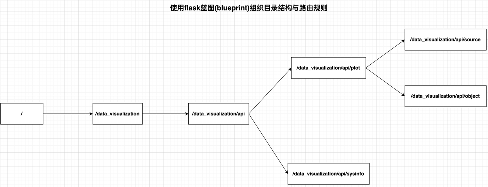

# 图表选择的依据


# 接口



# 数据规范

### 数据类型

三种数据类型

| 数据类型 | 示例                                                                                                       |
|------|----------------------------------------------------------------------------------------------------------|
| 时间   | 1. 开始时间（2020-01-01 或者 2020/01/01）<br/> 2. 结束时间（2022-01-07 或者 2020/01/07）<br/> 3. 时间间隔（1s、1m、1h、1d、1m、2y） |
| 数据   | 数字类型数据                                                                                                   |
| 类别   | 字符串类型数据                                                                                                  |

### 维度规范

| 维度类型 | 数据组成      |
|------|-----------|
| 二维   | 两个序列      |
| 三维   | 一个序列+一个字典 |

# 开发日志

## 2023.08.02

暂时不去考虑plot_task、多线程、mysql事务

关于不使用mysql事务：
由于不涉及需要开启事务的情况，原因有2：
1. 程序暂不支持并发，所有的操作都是顺序执行的 
2. 批量插入的操作准备进行sql拼接，用一条sql语句插入多条数据

关于plot_task任务单：
决定剔除plot_task任务单，access_log表中的access_log_id已经可以充当plot_task的功能，没必要维护一个plot_result

首先将绘图功能实现，大体流程是：
1. 用户访问接口，access_log记录
2. 顺序的方式生成plot_result，生成的过程包括：生成图片 --> 上传图片到fastdfs
3. 向用户返回结果

## 2023.08.05

开始设计flask API部分。

### 项目遗留搁置问题：

~~1. 要为每一个 以面向对象设计 的python软件包 建立一个通用的interface。这个interface可以考虑写到__init__.py里（先要弄清楚__init__.py文件是干什么的）  
这个搁置问题的起因是：data_visualization.dao.plot_result_dao中的TODO。~~（已完成 2023.08.07）

### 资料准备

[flask应用错误处理](https://dormousehole.readthedocs.io/en/latest/errorhandling.html)

[flask蓝图](https://dormousehole.readthedocs.io/en/latest/blueprints.html)

## 2023.08.07

已完成dao层与domain层的重构。

接下来，如果想修改数据库表的字段，会简单很多：
* **之前**：改dao层每一个方法的sql语句（最繁琐的在这里），改domain数据对象的`__slots__`、`__init__`
* **现在**：改domain数据对象的`__slots__`、`__init__`即可

全面开始开发api层

## 2023.08.12

基础项目架构搭建完成。

## 2023.08.14

数据源模式的绘图接口**最基础的功能**开发完成

### 接口调用示例：

POST http://127.0.0.1:5001/plot/source

### 请求体

```json
{
  "plot_title": "订单量",
  "time_data_list": ["2023-01-01", "2023-01-02", "2023-01-03", "2023-01-04", "2023-01-05", "2023-01-06", "2023-01-07"],
  "num_data_list": [1, 2, 3, 4, 5, 6, 7]
}
```

